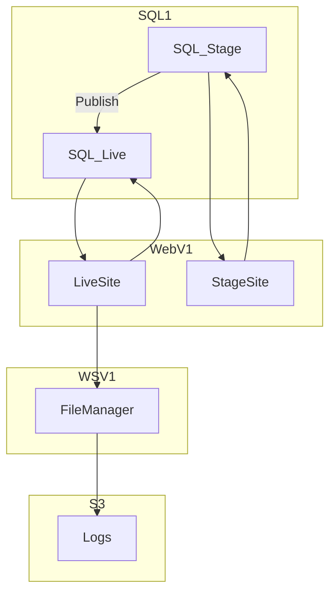

# ACTL

```mermaid
graph TD;
    subgraph SQL1
        SQL_Stage
        SQL_Live
    end
    subgraph WebV1
        LiveSite
        StageSite
    end
    subgraph WSV1
        FileManager
    end
    subgraph S3
        Logs
    end
    SQL_Stage--Publish-->SQL_Live
    StageSite-->SQL_Stage-->StageSite
    LiveSite-->SQL_Live-->LiveSite
    LiveSite-->FileManager
    FileManager-->Logs
```
